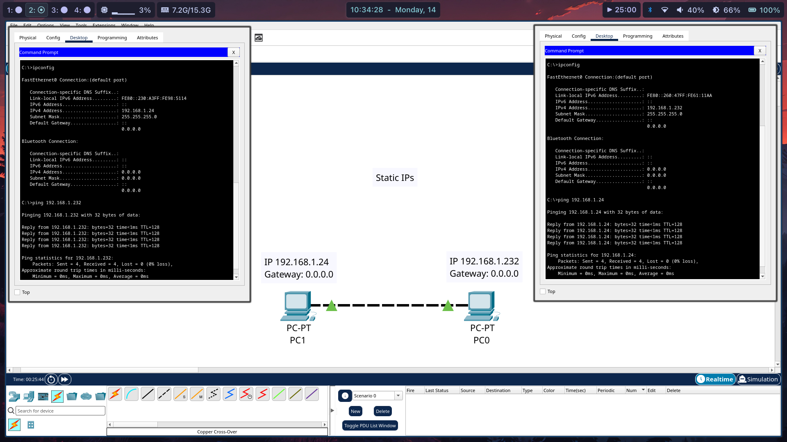

## Hello World

- Two PCs pinging each other (The Hello World of networking)

### What did I do?
- Put two PCs on the logic view
- Linked both PCs with a **crossed copper cable**
- Set the static IP on each one (192.168.1.xxx)
- Left the gateway empty
- Opened the terminal in each one and used the commands
  - "ipconfig" to get the information of the network
  - "ping 192.168.1.xxx" to send a ping to the other PC
  
### What did I learn?
- The difference between cables
  - Straight copper cable -> different devices
  - Crossed copper cable -> Same devices
